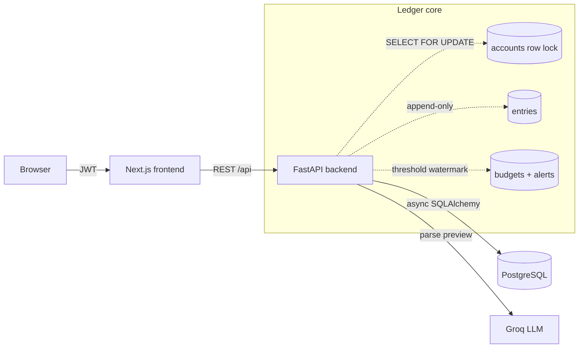

# Ledgerly

[](https://nextjs.org/)
[](https://fastapi.tiangolo.com/)
[](https://www.postgresql.org/)
[](https://www.docker.com/)
[](LICENSE)

Ledgerly is an AI-powered personal finance platform featuring an immutable financial ledger, intelligent transaction categorization, budgeting, analytics dashboards, and natural-language transaction entry.

---

## Screenshots

<div align="center">
  <p align="center">
    <strong>Dashboard & Running Balance Analytics</strong>
  </p>
  <!-- Replace with actual hosted screenshot links or docs/dashboard.png in your repo -->
  
</div>

---

## Why Ledgerly?

Most personal finance apps focus only on CRUD operations. Ledgerly explores accounting-inspired concepts such as immutable ledgers, transaction reversals, optimistic financial analytics, AI-assisted transaction entry, and budget-aware spending insights while remaining lightweight enough for personal use.

---

## Features

- **Immutable Financial Ledger**: Follows professional accounting standards where entries are permanently logged—corrections are made with reversing entries, never inline edits or deletions.
- **Dynamic Analytics Dashboard**: Derived automatically from effective entries to show total income, expenses, category breakdown donut charts, and cumulative balance progression.
- **Budget Health with Staged Alerts**: Set monthly spending limits (globally or per-category) and receive alerts when crossing key spending watermarks (50%, 80%, and 100%).
- **AI-Powered Natural-Language Entry**: Enter transactions in plain English (e.g., *"Spent 100 on groceries yesterday"*). Parses using Llama 3.3 (via Groq) and feeds a human-in-the-loop confirmation preview.
- **Transaction Reversals with Auto-Netting**: Reversing a transaction automatically nets out its impact from dashboards, category breakdown charts, and budget MTD spent calculations.

---

## Architecture Philosophy

Ledgerly is built around a simple principle:

> **"The ledger is immutable; analytics are derived."**

Transactions are never edited or deleted. Corrections are represented through compensating reversal entries. Financial reports, budgets, and dashboards derive their values from effective transactions while the ledger preserves a complete audit trail.

---

## Architecture



---

## Tech Stack

| Layer | Choice | Why |
|---|---|---|
| **Frontend** | Next.js 16 (App Router) · React 19 · TypeScript · Tailwind v4 | Modern web development stack; type-safe end to end |
| **Data/UX** | TanStack Query · React Hook Form · Zod · Recharts · sonner | Caching, validation, interactive charts, toasts, and loading states |
| **Backend** | FastAPI · async SQLAlchemy 2.0 · asyncpg · Pydantic v2 | Async I/O, auto OpenAPI/Swagger documentation, strict schemas |
| **Auth** | JWT · Argon2id (`argon2-cffi`) | Argon2id is the OWASP-recommended, memory-hard hashing standard |
| **Database** | PostgreSQL + Alembic migrations | Strict constraints, row locks, and versioned schema migrations |
| **AI Runtime** | Groq (Llama 3.3) | High-speed inference for natural-language transaction extraction |
| **Ops** | Docker Compose | One-command local environment execution |

---

## Project Structure

```
backend/                 FastAPI service
  app/
    core/                config, money (integer paise), security (Argon2id/JWT), errors
    models/              SQLAlchemy: user, account, category, entry, budget, notification…
    services/            ledger (lock-safe, append-only), budgets, notifications, ai_parser
    api/routes/          auth, entries, categories, summary, budgets, notifications
  alembic/               migrations
  tests/                 pytest (money, idempotency, concurrency, budgets, auth)
frontend/                Next.js App Router
  src/app/               (auth pages) + (app) group: dashboard, transactions, budgets
  src/components/        add-transaction (manual + AI), budget-card, charts, notification-bell…
  src/lib/               api client, auth context, money/time helpers, types
docker-compose.yml       full stack in one command
```

---

## Getting Started

### Option A — Docker (one command)
```bash
# From the repo root
GROQ_API_KEY=your_key docker compose up --build
```
- App → [http://localhost:3000](http://localhost:3000)
- API docs → [http://localhost:8000/docs](http://localhost:8000/docs)

*(Note: `GROQ_API_KEY` is optional. Leaving it out disables the natural-language feature gracefully while keeping all other core functions operational.)*

### Option B — Run Each Service Locally

**1. Backend** (Requires a local PostgreSQL instance):
```bash
cd backend
python -m venv .venv
# On Windows:
.venv\Scripts\activate
# On macOS/Linux:
source .venv/bin/activate

pip install -e ".[dev]"
cp .env.example .env     # Edit DATABASE_URL and GROQ_API_KEY in the file
alembic upgrade head
uvicorn app.main:app --reload
```

**2. Frontend**:
```bash
cd frontend
npm install
cp .env.example .env.local    # Set NEXT_PUBLIC_API_URL=http://127.0.0.1:8000
npm run dev
```

---

## Environment Variables

| Service | Variable | Purpose |
|---|---|---|
| backend | `DATABASE_URL` | `postgresql+asyncpg://…` connection string |
| backend | `JWT_SECRET` | Signing secret for access tokens |
| backend | `GROQ_API_KEY` | Enables natural-language entry (optional) |
| backend | `CORS_ORIGINS` | Comma-separated allowed origins |
| backend | `LARGE_TXN_THRESHOLD_MINOR` | Large-transaction flag threshold, in minor units (paise) |
| frontend | `NEXT_PUBLIC_API_URL` | Base URL of the FastAPI backend |

---

## Deployment

Refer to [DEPLOYMENT.md](DEPLOYMENT.md) for a comprehensive, step-by-step walkthrough detailing how to deploy Ledgerly's PostgreSQL database to Supabase, the FastAPI backend to Render, and the Next.js frontend to Vercel.

---

## Testing

The backend test suite is written using pytest and verifies all correctness guarantees (including concurrency safety and reversing math):

```bash
cd backend
pytest -q
```

**What the tests verify:**
- Concurrency balance updates under 20 simultaneous API writes (using `SELECT ... FOR UPDATE`).
- Write idempotency (preventing duplicate transactions on retry).
- Append-only schema integrity (asserting that `UPDATE` and `DELETE` actions are blocked).
- Compensating reversal math (asserting that reversing offsets sum to zero on analytics).
- Budget threshold notifications firing exactly once per threshold per month.

---

## Architecture & Engineering Decisions

### AI-Assisted Development
Ledgerly was developed using modern AI-assisted engineering workflows. AI accelerated boilerplate implementation and iterative development, while architectural decisions, product direction, debugging, deployment, testing, and system design remained developer-driven.

### Engineering Decisions
- **Integer Minor Units**: Naive financial software often handles currency as floats, leading to binary rounding drift (e.g., `0.1 + 0.2 = 0.30000000000000004`). Ledgerly converts all money inputs to integer minor units (paise) at the system boundaries using `Decimal` and banker's rounding, avoiding float drift completely.
- **Append-only Invariant**: Conventional databases allow users to edit and delete records. Ledgerly enforces immutability on transactions. If a correction is needed, a compensating entry is written to net the balance.
- **Concurrency Safety via Pessimistic Row Locking**: Reading, updating, and writing balance values causes lost updates under heavy concurrent traffic. Ledgerly locks the target `Account` row (`SELECT ... FOR UPDATE`) during write operations to serialize updates and guarantee accuracy.
- **Write Idempotency**: Network retries can result in double-charges. Ledgerly validates incoming requests against an `Idempotency-Key` schema, returning the original response on duplicate submissions instead of writing a new row.
- **Dynamic SQL Window Sums**: Running balances in dashboard charts are dynamically generated using PostgreSQL window queries (`SUM(delta) OVER (ORDER BY created_at)`) on effective rows. This avoids fetching large transaction histories to compute totals in memory, scaling to millions of rows efficiently.

---

## Future Roadmap

- **Recurring Transactions**: Support automated monthly/weekly ledger entries.
- **CSV/OFX Import & Export**: Expose bulk export capabilities for external spreadsheet analysis.
- **Multi-Currency Support**: Add conversion support utilizing live currency exchange API syncs.
- **Confidence-Gated Auto-Categorization**: Push natural-language categorizations to a queue-based background task to keep web requests instant.

---

## Contributing

We welcome contributions! Please open an issue to discuss proposed enhancements before submitting a pull request. Make sure to run `pytest` and `ruff check` in the backend, and verify that the frontend builds without TypeScript warnings before submitting.

---

## License

This project is licensed under the MIT License - see the [LICENSE](LICENSE) file for details.
