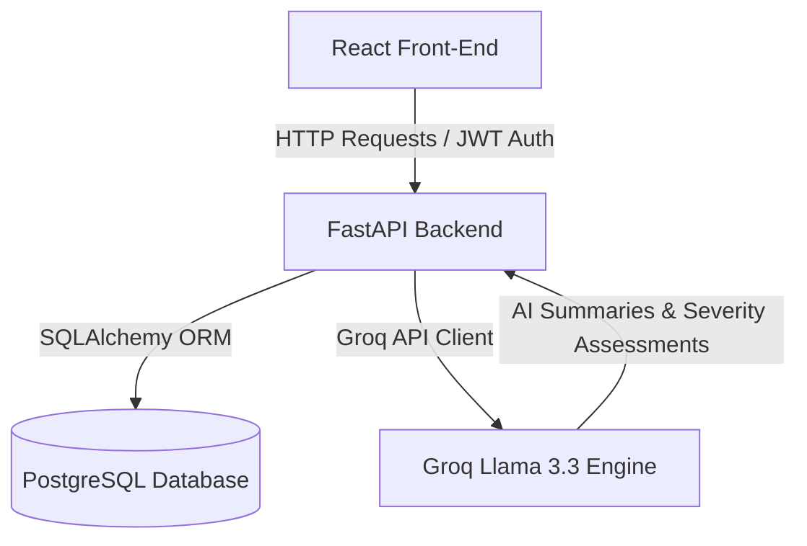

# Sentinel Ops 🛡️

**Sentinel Ops** is an enterprise-grade AI-Powered Security Incident Command Center designed for high-stakes, high-velocity DevOps and Security Operations. It enables infrastructure and security teams to monitor active alerts, coordinate incident response lifecycles, audit activity logs, and leverage AI insights for automated risk assessments and recovery runbooks.

Live Demo Link: **[https://sentinel-ops-pied.vercel.app](https://sentinel-ops-pied.vercel.app)**

---

## 🎨 Design System: "Obsidian Command"

Sentinel Ops runs on the **Obsidian Command** theme—a minimalist, glassmorphic design system tuned for dark-mode command consoles to minimize eye strain during long-duration triage.

*   **Color Palette:** Tiered dark surfaces based on Zinc (`#18181b`) against a deep-space black background (`#09090b`), utilizing low-opacity borders (`white/10%`) for minimalist containers.
*   **AI Indicators:** Distinctive violet/indigo accents (`#7C3AED` / `#dfd1ff` glow) reserved for intelligent summaries and AI-driven actions.
*   **Status Indicators:** High-contrast traffic-light status colors (Red, Amber, Emerald) with radial glow filters to highlight active critical issues.
*   **Typography:** Strict separation using **Inter** for readability of interface labels/metatags and **JetBrains Mono** for raw technical strings (IDs, durations, and code logs).

---

## ✨ Features

*   **Operations Command Center (Dashboard):**
    *   Dynamic counters tracking **Active Incidents**, **Critical Severity**, **Assigned to Me**, and **Resolved Today** (with daily local timezone boundary correction).
    *   Full-width Recent Incidents table equipped with frontend-only pagination and paging metrics.
*   **Active Incident Lifecycle Management:**
    *   State-machine restricted transitions: `Open` ➔ `Investigating` ➔ `Identified` ➔ `Resolving` ➔ `Resolved`.
    *   Lock mechanism: Assignee, description, and severity inputs are automatically locked once an incident is resolved to preserve history.
    *   Mandatory Post-Incident Review: Transition to `Resolved` requires saving a debrief/resolution draft.
*   **AI Sentinel (Llama 3.3 Integration):**
    *   Integrates with Groq Cloud running Llama 3.3 models to compile real-time summaries, risk factors, and recommended runbook steps.
    *   "Sync AI Severity" button allows operators to instantly align the incident severity with the machine-assessed threat level.
*   **Auditable System Events:**
    *   Platform-wide audit logs rendering updates, assignments, and status modifications.
    *   Granular filter options: text search (with padded magnifying glass overlay), dropdown type filter, ascending/descending time order, and paginated size control.

---

## 💻 Tech Stack

### Frontend
*   **Core:** React 18, TypeScript, Vite
*   **Routing:** React Router DOM
*   **Icons:** Lucide React
*   **Styling:** CSS Variables (Obsidian Command Theme) + Tailwind CSS (utilities)
*   **API Client:** Axios

### Backend
*   **Framework:** FastAPI (Python)
*   **ORM:** SQLAlchemy
*   **Database:** PostgreSQL
*   **Migrations:** Alembic
*   **Authentication:** JWT Bearer (python-jose, passlib)
*   **Server:** Uvicorn
*   **AI Engine:** Groq Cloud SDK (Llama 3.3)

---

## 🛠️ Getting Started (Local Setup)

### Prerequisites
*   Node.js (v18+)
*   Python (v3.10+)
*   PostgreSQL Database
*   Groq Cloud API Key

---

### Step 1: Clone the Repository
```bash
git clone https://github.com/PradyumnKR/sentinel-ops.git
cd sentinel-ops
```

---

### Step 2: Database Creation
Login to your PostgreSQL instance and create a blank database:
```sql
CREATE DATABASE sentinel_ops;
```

---

### Step 3: Backend Configuration & Startup
1.  Navigate into the `backend` directory:
    ```bash
    cd backend
    ```
2.  Set up your virtual environment and install dependencies:
    ```bash
    # Create virtual environment
    python -m venv venv

    # Activate virtual environment
    # On Windows (PowerShell):
    .\venv\Scripts\Activate.ps1
    # On macOS/Linux:
    source venv/bin/activate

    # Install packages
    pip install -r requirements.txt
    ```
3.  Create an environment file `.env` in the `backend/` directory:
    ```ini
    DATABASE_URL=postgresql://<DB_USER>:<DB_PASSWORD>@<DB_HOST>:5432/sentinel_ops
    SECRET_KEY=<YOUR_GENERATED_JWT_SECRET_KEY>
    ALGORITHM=HS256
    ACCESS_TOKEN_EXPIRE_MINUTES=30
    GROQ_API_KEY=<YOUR_GROQ_API_KEY>
    ```
4.  Run database migrations to generate database tables:
    ```bash
    alembic upgrade head
    ```
5.  Start the FastAPI local development server:
    ```bash
    uvicorn app.main:app --reload --port 8000
    ```
    The API docs will be available at `http://localhost:8000/docs`.

---

### Step 4: Frontend Configuration & Startup
1.  Open a new terminal window, navigate to the `frontend/` directory:
    ```bash
    cd frontend
    ```
2.  Install packages:
    ```bash
    npm install
    ```
3.  Create an environment file `.env` in the `frontend/` directory:
    ```ini
    VITE_BACKEND_URL=http://localhost:8000
    VITE_API_URL=http://localhost:8000/api
    ```
4.  Start the Vite local development server:
    ```bash
    npm run dev
    ```
    Open your browser and navigate to `http://localhost:5173`.

---

## 📈 System Architecture



---

## 🔒 Authentication Flow
Sentinel Ops uses OAuth2 JWT Bearer authentication. When configuring locally, the `/api/auth/signup` and `/api/auth/login` endpoints handle token generation and signing. Ensure to configure a strong `SECRET_KEY` in your backend env configuration.

## 📄 License
This project is licensed under the MIT License.
